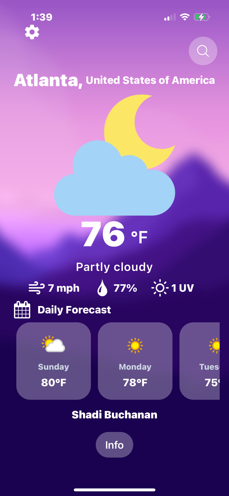

# Weather App

This Weather App is a mobile application built using React Native and Expo. It leverages the WeatherAPI to provide users with current weather conditions, a 7-day forecast, and other useful information like UV index and wind speed. The app is designed to be user-friendly, with a clean interface and settings that allow users to toggle between Celsius/Fahrenheit and Kilometers/Miles.



## Features

- **Current Location Weather**: The app automatically detects the user's current location using the device's GPS and fetches the relevant weather data for that location.
- **7-Day Weather Forecast**: Users can view the weather forecast for the next 7 days, including temperature, weather conditions, and other relevant data.
- **Day/Night Image Display**: The app dynamically displays different weather images based on whether it is day or night.
- **Temperature and Distance Unit Toggle**: Users can switch between Celsius and Fahrenheit for temperature and between Kilometers and Miles for wind speed.
- **UV Index Display**: The app also shows the UV index for the current location, helping users stay informed about sun exposure levels.
- **Search Functionality**: Users can search for weather in different cities and view their weather forecasts.

## Technologies Used

- **React Native**: A popular framework for building native mobile applications using JavaScript and React.
- **Expo**: A platform that makes React Native development faster and easier by providing tools and services for building and deploying apps.
- **WeatherAPI**: A powerful weather API used to fetch real-time weather data and forecasts based on the user's location or searched cities.
- **Expo Location**: Used to access the device's GPS to determine the user's current location.

## Installation

1. **Clone the repository**:
   ```bash
   git clone https://github.com/yourusername/weather-app.git
   ```
2. **Navigate to the project directory**:
   ```bash
   cd weather-app
   ```
3. **Install the Dependencies**:
   ```bash
   npm install
   ```
4. **Run the app**:
   ```bash
   npx expo start
   ```

## How It Works

1. **Fetching Location Data**: 
   - The app requests permission to access the user's location. If granted, it uses the Expo Location API to get the user's current latitude and longitude, which are then used to fetch the weather data for that location.
   
2. **Fetching Weather Data**: 
   - The app calls the WeatherAPI using the coordinates or a city name to get the current weather and a 7-day forecast. The weather data includes temperature, conditions, wind speed, UV index, and more.

3. **Displaying Weather Information**: 
   - The app dynamically displays weather information with corresponding images for different weather conditions. It handles both day and night scenarios by displaying appropriate images based on the time of day.

4. **Settings Dropdown**: 
   - The user can toggle between Celsius and Fahrenheit for temperature and Kilometers and Miles for wind speed using a settings dropdown menu. The dropdown is easily accessible from the main screen.
